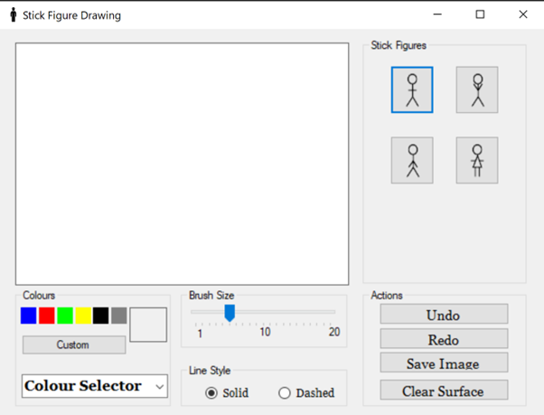

# Stick Figure Drawing Program from HomeLearn

## Table of Contents

- [Overview](#overview)
  - [The challenge](#the-challenge)
  - [Screenshot](#screenshot)
  - [Built with](#built-with)
  - [What I learned](#what-i-learned)
  - [Continued development](#continued-development)
- [Author](#author)

### Overview
This project is a drawing program that allows the user to add stick figures and text to their design in any colour. 

### The challenge

Users should be able to:

- Draw stick figures in different colours and add text to their drawing.
- Be able to save the picture to their device
- Be able to edit their picture through the undo and redo buttons

### Screenshot

### Built with

- C#
- Git
- Visual Studio

### What I learned

I learned about using Git for version control and I did make some rookie mistakes. One of the mistakes I made was not fully synching the previous branch 
to the main branch on Github before opening a new branch and trying to push new code to a new branch in the respository.

I also learned about creating different shapes, accessing system colours and fonts, how to create a dialog box, how to use boolean flags, bitmap and graphic objects. 

### Continued development

I would like to continue my development by learning more about how Azure and Git can be intergrated with visual studios to provide a seamless version control system 
through the use of virtual respositories.

I could explore coding additional designs that users would be able to add to their picture e.g trees or objects

## Author

- Website - [Sherah Israel](https://sherahisrael.github.io/-/)
